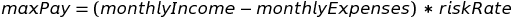
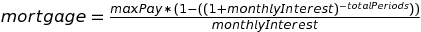

# Mortgage Calculator

[](https://travis-ci.org/cristobal-io/mortgage-calculator) [](https://coveralls.io/github/cristobal-io/mortgage-calculator?branch=master)

This is a node module that allows you to calculate the maximum mortgage that you can afford based on your salary and the initial Deposit you will make.

It is based on the assumption that no more than 36% of your salary before taxes should be designated to the mortgage to avoid financial problems.

You can check the article about the [Underwriter](http://www.realtor.com/advice/the-underwriter-unseen-approver-of-your-mortgage/) for more information.

The maximum allowed by law is a 43% before taxes, however many articles suggest that you shouldn't take a mortgage over 36%.

---

## Formulas

- The formula used to obtain the payment:



- The formula used to obtain the mortgage <sup>[1](#formula)</sup> :



---

### Installation.

    npm install mortgage-calculator

or [download](https://raw.githubusercontent.com/cristobal-io/mortgage-calculator/master/dist/mortgage-calculator.min.js) the minified version

---

### Usage.

#### on node.js

    var mortgageCalculator = require("mortgage-calculator");

#### On the browser.

`window.mortgageCalculator` will be exposed after including the script.

    <script src="morgage-calculator.min.js"></script>

---

### Methods.

#### mortgageCalculator.getMaxMortgage

This method will tell you the price of the house that you can afford.

```
mortgageCalculator.calculateMortgage(options);
```

##### options

- `initialDeposit`: How much money will you pay upfront.
- `monthlyIncome`: Gross monthly income.
- `interest`: Interest rate.
- `term`: Duration in years of the mortgage. Default: `10`
- `payments`: number of payments, the term has priority, if no term is provided, will use payments, if no payments are provided, it will use the term's default.
- `monthlyExpenses`: Personal monthly expenses.
- `age`: Age of the youngest person taking the loan.
- `settings`: (optional)
    + `maxAge`: Maximum age restricts the length of the term. Default: `65`
    + `riskRate`: Maximum percent of risk. Default:`36`
    + (`personalTaxRate`: Percent of the monthly income that is paid as taxes. Default: `42`.) -> future version.

#### mortgageCalculator.formatMoney

This method will format an integer to the desired localized format

```
mortgageCalculator.formatMoney(number, options);
```

##### number

This will be the value you want to format.

##### options

- `symbol`: Default `"$"`
- `places`: Default `2`
- `thousand`: Default `","`
- `decimal`: Default `"."`

#### mortgageCalculator.amortization

This method will give you the table of amortization.

```
mortgageCalculator.amortization(capital, pay, periods, interest);
```

##### capital

Total value of the mortgage we want to obtain the amortization table for.

##### pay

Calculated monthly pay obtained from mortgageCalculator.getMaxMortgage

##### periods

Number of payments for the amortization.

##### interest

Annual interest not expressed in %

    example:
    3% --> 3/100 = 0.03

---

### Contributor notes:

To start run:

```bash
make setup
```

For test use command:

```bash
make test
```

For test on Browsers use [testem](https://github.com/airportyh/testem):

```bash
make testem
```

---

### Notes:

- For linting uses http://jshint.com/
- For style uses http://jscs.info/ 

<a name="formula">1</a>: _This formula comes from:_

 
